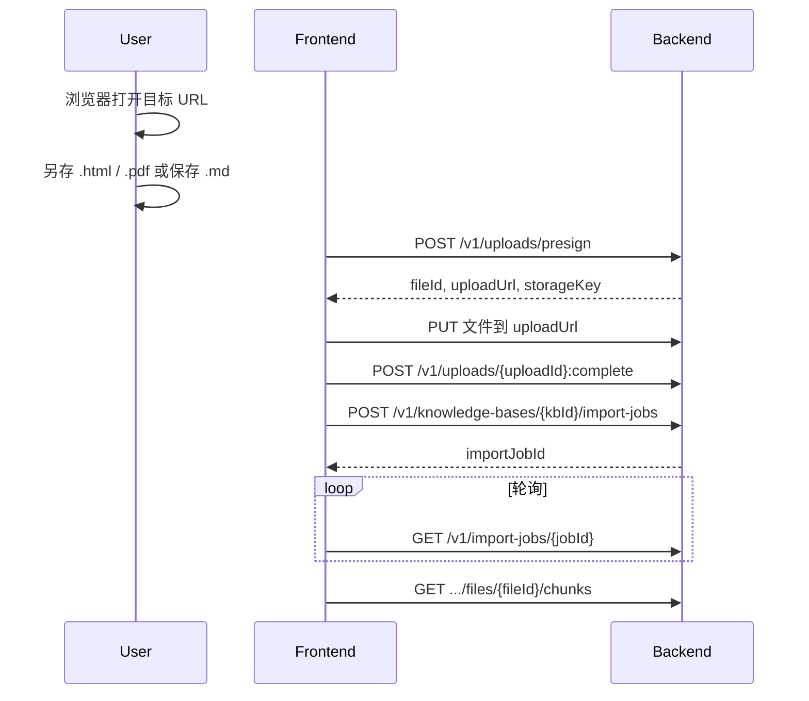

# 网页内容导入：文件上传方式（推荐）

> **适用场景**：`web-imports` 因 DNS/代理（如 fake-ip 解析到 `198.18.x.x`）报「不允许访问内网或保留地址」；或内网/VPN 页面无法由服务端抓取。  
> **受众**：前端  
> **Base URL（本地）**：`http://127.0.0.1:8000`  
> **关联**：[`web-import-api.md`](web-import-api.md)（URL 直连抓取）、[`frontend-api-integration.md`](../confluence/frontend-api-integration.md) §5.2 / §6

---

## 1. 思路

不在后端请求公网 URL，由用户在浏览器打开页面后：

1. **另存为** `.html` / `.pdf`，或复制正文保存为 `.md`；
2. 走与普通文档相同的 **presign → 上传 → complete → import-job**；
3. 后端解析并分段入库（`.html` 会先抽正文再按 Markdown 分段）。

| 用户操作 | 上传扩展名 | 后端解析 |
|----------|------------|----------|
| 另存为「网页，仅 HTML」 | `.html` / `.htm` | Trafilatura / Readability → Markdown → 按标题分段 |
| 打印 / 另存为 PDF | `.pdf` | PDF 解析（可选增强） |
| 复制正文到文件 | `.md` | Markdown 按 `#` 标题分段 |

**示例**：`https://docs.vespa.ai/en/rag/rag.html` 在代理环境下 web-import 会失败，可浏览器打开后 **另存 HTML** 或 **复制为 .md** 再上传。

---

## 2. 推荐前端流程



---

## 3. 步骤 1：Presign

```http
POST /v1/uploads/presign
Authorization: Bearer {accessToken}
Content-Type: application/json
```

**另存 HTML（Vespa 文档页示例）**：

```json
{
  "knowledgeBaseId": "64e37340-9532-43d4-961e-24fce93bd79b",
  "files": [
    {
      "fileName": "vespa-rag.html",
      "mimeType": "text/html",
      "sizeBytes": 245760
    }
  ]
}
```

**保存 Markdown**：

```json
{
  "knowledgeBaseId": "{kbId}",
  "files": [
    {
      "fileName": "vespa-rag.md",
      "mimeType": "text/markdown",
      "sizeBytes": 12000
    }
  ]
}
```

**PDF**：

```json
{
  "fileName": "vespa-rag.pdf",
  "mimeType": "application/pdf",
  "sizeBytes": 1048576
}
```

**响应 201**：记下 `uploads[0].fileId`、`uploadId`、`uploadUrl`、`storageKey`。

开发环境：将文件写入 `{LOCAL_UPLOAD_ROOT}/{storageKey}`（见项目 `LOCAL_UPLOAD_ROOT`），再调 complete。

---

## 4. 步骤 2：Complete

```http
POST /v1/uploads/{uploadId}:complete
Authorization: Bearer {accessToken}
Content-Type: application/json

{
  "fileId": "file_xxxxxxxx",
  "storageKey": "kb/{kbId}/file_xxxxxxxx.html"
}
```

---

## 5. 步骤 3：Import Job（分段 + 索引）

```http
POST /v1/knowledge-bases/{kbId}/import-jobs
Authorization: Bearer {accessToken}
Content-Type: application/json

{
  "fileIds": ["file_xxxxxxxx"],
  "chunking": {
    "strategy": "default",
    "indexSize": 512,
    "metadata": {
      "includeFileName": true,
      "includeHeadings": true
    }
  }
}
```

权限：`kb:import`。

轮询：

```http
GET /v1/import-jobs/{importJobId}
```

`status === "completed"` 后：

```http
GET /v1/knowledge-bases/{kbId}/files/{fileId}/chunks?page=1&pageSize=20
```

`chunking` 字段说明见 [`web-import-api.md` §5](web-import-api.md#5-chunking-分段配置)。

---

## 6. 与 web-imports 对比

| 对比项 | `POST .../web-imports` | 本流程（文件上传） |
|--------|------------------------|-------------------|
| 是否需要公网 DNS | 是（服务端抓取） | 否 |
| 代理 fake-ip | 易导致失败 | 不影响 |
| 用户步骤 | 只填 URL | 另存文件 + 上传 |
| 分段配置 | `chunking` 在 web-import 请求 | `chunking` 在 import-jobs 请求 |
| `.html` 支持 | 不经过此接口 | ✅ 上传后解析 |

---

## 7. 前端 UI 建议

当 `web-imports` 返回 `IMPORT_PARSE_FAILED` 且 message 含「内网或保留地址」时：

1. 提示：「当前网络 DNS 无法由服务器直接抓取该 URL，请改用本地上传。」
2. 引导用户：**另存网页 / 保存 PDF / 粘贴为 Markdown 文件**；
3. 打开已有 **文件上传 + 导入** 向导（presign 流程），不要重复调用 web-import。

---

## 8. 调用示例（fetch）

```typescript
async function importSavedHtmlFile(
  kbId: string,
  file: File,
  token: string,
  apiBase: string,
) {
  const presign = await fetch(`${apiBase}/v1/uploads/presign`, {
    method: "POST",
    headers: {
      Authorization: `Bearer ${token}`,
      "Content-Type": "application/json",
    },
    body: JSON.stringify({
      knowledgeBaseId: kbId,
      files: [
        {
          fileName: file.name,
          mimeType: file.type || "text/html",
          sizeBytes: file.size,
        },
      ],
    }),
  }).then((r) => r.json());

  const upl = presign.data.uploads[0];
  await fetch(upl.uploadUrl, { method: "PUT", body: file });

  await fetch(`${apiBase}/v1/uploads/${upl.uploadId}:complete`, {
    method: "POST",
    headers: {
      Authorization: `Bearer ${token}`,
      "Content-Type": "application/json",
    },
    body: JSON.stringify({
      fileId: upl.fileId,
      storageKey: upl.storageKey,
    }),
  });

  const job = await fetch(`${apiBase}/v1/knowledge-bases/${kbId}/import-jobs`, {
    method: "POST",
    headers: {
      Authorization: `Bearer ${token}`,
      "Content-Type": "application/json",
    },
    body: JSON.stringify({
      fileIds: [upl.fileId],
      chunking: {
        strategy: "default",
        indexSize: 512,
        metadata: { includeFileName: true, includeHeadings: true },
      },
    }),
  }).then((r) => r.json());

  return { fileId: upl.fileId, importJobId: job.data.id };
}
```
