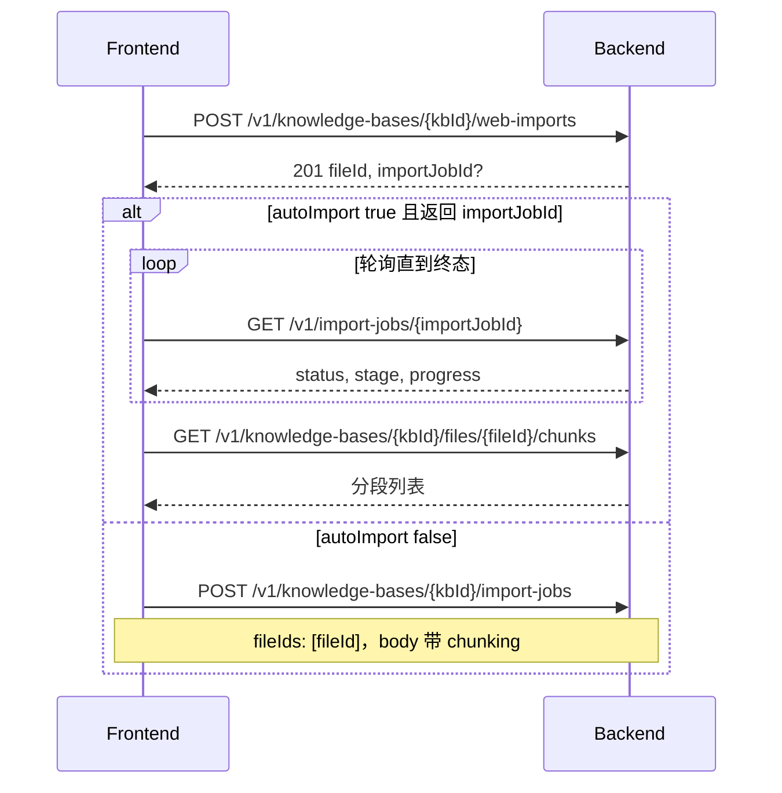

# 网页 URL 导入 API（前端联调）

> **受众**：前端  
> **Base URL（本地）**：`http://127.0.0.1:8000`  
> **字段命名**：请求/响应 JSON 均为 **camelCase**  
> **关联文档**：通用约定见 [`docs/confluence/frontend-api-integration.md`](../confluence/frontend-api-integration.md)

## 1. 能力说明（自动抓取，无需用户手转文件）

前端只需提交 **公网 URL**，后端会：

1. 校验 URL（SSRF：用**公共 DNS** 判断是否为公网地址，避免本机 Clash fake-ip 误拦）；
2. 抓取 HTML → 抽正文为 Markdown → 落盘 `.md`；
3. 可选自动 `import-job` 分段入库。

**用户不需要**在浏览器里另存 HTML/PDF。仅当目标页**真实内网**或抓取失败时，才考虑 [文件上传备选](file-import-from-web-page.md)。

本接口**不是**「仅分段预览」：会注册知识库文件（`fileId`），并可自动 **import-job**（分段 + 向量化 + 入库）。分段策略由请求体 **`chunking`** 控制（与 `import-jobs` 相同）。

---

## 2. 推荐前端流程



| 步骤 | 接口 | 说明 |
|------|------|------|
| 1 | `POST .../web-imports` | 抓取 URL、落盘、可选自动建 job |
| 2 | `GET /v1/import-jobs/{jobId}` | 轮询 `status`：`queued` → `running` → `completed` / `failed` |
| 3 | `GET .../files/{fileId}/chunks` | 查看 Data 分段（入库完成后） |
| 4（可选） | `POST .../hit-test` | 检索验证 |

---

## 3. 创建网页导入

### 3.1 请求

```http
POST /v1/knowledge-bases/{kbId}/web-imports
Authorization: Bearer {accessToken}
Content-Type: application/json
Idempotency-Key: {optional}
```

| 路径参数 | 类型 | 说明 |
|----------|------|------|
| `kbId` | string | 知识库 ID |

### 3.2 请求体

| 字段 | 类型 | 必填 | 默认 | 说明 |
|------|------|------|------|------|
| `url` | string (URL) | 是 | — | 仅 `http` / `https`；禁止 localhost、内网 IP（SSRF） |
| `autoImport` | boolean | 否 | `true` | `true` 时自动创建 import-job 并在后台执行索引 |
| `useBrowserFallback` | boolean | 否 | 服务端配置 | 静态抽取质量不足时用 Playwright 渲染后再抽 |
| `chunkStrategy` | string | 否 | `"default"` | 无 `chunking` 时生效；有 `chunking` 时被覆盖 |
| `chunking` | object | 否 | — | 分段配置，结构见 [§5](#5-chunking-分段配置) |
| `parsing` | object | 否 | — | 解析选项；网页场景常用 `webUseBrowserFallback` |

**`useBrowserFallback` 与 `parsing.webUseBrowserFallback` 二选一**：请求体顶层字段优先。

**推荐请求（自动导入 + 默认分段）**：

```json
{
  "url": "https://www.example.com/en/insights/some-article/",
  "autoImport": true,
  "useBrowserFallback": false,
  "chunking": {
    "strategy": "default",
    "indexSize": 512,
    "metadata": {
      "includeFileName": true,
      "includeHeadings": true
    }
  }
}
```

**仅抓取落盘、稍后手动 import**：

```json
{
  "url": "https://www.example.com/page",
  "autoImport": false
}
```

### 3.3 成功响应 `201 Created`

```json
{
  "data": {
    "fileId": "file_a1b2c3d4e5f6",
    "fileName": "Article-Title-From-Page.md",
    "storageKey": "kb/{kbId}/file_a1b2c3d4e5f6.md",
    "sourceUrl": "https://www.example.com/en/insights/some-article/",
    "extractionMethod": "trafilatura",
    "importJobId": "job_7c8d9e0f"
  },
  "requestId": "req_..."
}
```

| 字段 | 类型 | 说明 |
|------|------|------|
| `fileId` | string | 知识库文件 ID；后续 chunks / citation / hit-test 使用 |
| `fileName` | string | 由页面标题或 URL 路径生成的 `.md` 文件名；重名自动 `-2`、`-3` |
| `storageKey` | string | 服务端落盘路径 |
| `sourceUrl` | string | 抓取后的最终 URL（含重定向） |
| `extractionMethod` | string | `trafilatura` \| `readability` \| `browser+trafilatura` 等 |
| `importJobId` | string \| 省略 | `autoImport=true` 且 worker 已装配时返回；否则无此字段 |

### 3.4 权限

| 接口 | 所需权限 |
|------|----------|
| `POST .../web-imports` | `kb:file:upload` |
| `GET /v1/import-jobs/{jobId}` | `kb:import` |
| `POST .../import-jobs`（手动触发） | `kb:import` |
| `GET .../files/{fileId}/chunks` | 知识库读权限（与文件列表一致） |

---

## 4. 关联接口（导入完成后）

### 4.1 查询导入任务状态

```http
GET /v1/import-jobs/{importJobId}
Authorization: Bearer {accessToken}
```

**响应 200**（`data` 摘要）：

```json
{
  "data": {
    "id": "job_7c8d9e0f",
    "knowledgeBaseId": "kb_xxx",
    "fileIds": ["file_a1b2c3d4e5f6"],
    "status": "running",
    "progress": 45,
    "stage": "embed",
    "errorCode": null,
    "errorMessage": null,
    "retryOf": null,
    "createdAt": "2026-06-04T12:00:00Z",
    "updatedAt": "2026-06-04T12:00:05Z"
  },
  "requestId": "req_..."
}
```

| `status` | 含义 |
|----------|------|
| `queued` | 排队 |
| `running` | 执行中 |
| `completed` | 成功，可拉 chunks |
| `failed` | 失败，看 `errorCode` / `errorMessage` |
| `cancelled` | 已取消 |

| `stage`（running 时） | 含义 |
|----------------------|------|
| `parse` | 解析 |
| `chunk` | 分段 |
| `embed` | 向量化 |
| `index` | 写入索引 |
| `done` | 结束 |

**前端轮询建议**：间隔 1～2s，`status` 为 `completed` / `failed` / `cancelled` 时停止。

### 4.2 列出文件分段（Data 层）

```http
GET /v1/knowledge-bases/{kbId}/files/{fileId}/chunks?page=1&pageSize=20
Authorization: Bearer {accessToken}
```

**查询参数**：

| 参数 | 类型 | 默认 | 说明 |
|------|------|------|------|
| `page` | int | 1 | ≥ 1 |
| `pageSize` | int | 10 | 1～100 |
| `q` | string | — | 可选，片段文本搜索 |
| `status` | string | — | 可选 |

**响应 200**（分页）：

```json
{
  "data": [
    {
      "dataId": "d000000",
      "text": "## 章节标题\n\n正文片段……",
      "charCount": 512,
      "page": null,
      "chunkIndex": 0,
      "citation": {
        "file_name": "Article.md",
        "data_id": "d000000"
      },
      "indexes": [
        {
          "indexId": "d000000-000",
          "text": "用于向量检索的较短文本……"
        }
      ]
    }
  ],
  "pagination": {
    "page": 1,
    "pageSize": 20,
    "total": 8,
    "hasMore": false
  },
  "requestId": "req_..."
}
```

### 4.3 单段详情（含上下文）

```http
GET /v1/knowledge-bases/{kbId}/files/{fileId}/chunks/{dataId}?context=1
```

`context`：前后各返回多少相邻 Data 段，0～10，默认 1。

### 4.4 手动创建 import-job（`autoImport: false` 时）

```http
POST /v1/knowledge-bases/{kbId}/import-jobs
Authorization: Bearer {accessToken}
Content-Type: application/json

{
  "fileIds": ["file_a1b2c3d4e5f6"],
  "chunking": {
    "strategy": "default",
    "indexSize": 512,
    "metadata": {
      "includeFileName": true,
      "includeHeadings": true
    }
  }
}
```

---

## 5. chunking 分段配置

与文件导入共用，网页导入后按 **Markdown** 解析再分段（有 `#` 标题时倾向按 section 切分）。

### 5.1 `strategy` 枚举

| 值 | 说明 |
|----|------|
| `default` | 默认递归切分；有标题时按章节（推荐网页文章） |
| `page` | 按页/block（网页通常无页码，少用） |
| `custom` | 需 `custom.mode` |
| `whole` | **不支持**，请求会 400 |

### 5.2 常用 `chunking` 示例

**默认（推荐）**：

```json
{
  "strategy": "default",
  "indexSize": 512,
  "metadata": {
    "includeFileName": true,
    "includeHeadings": true
  }
}
```

**自定义：按段落深度**（`custom.mode = paragraph`）：

```json
{
  "strategy": "custom",
  "custom": { "mode": "paragraph" },
  "paragraph": {
    "useModel": false,
    "maxDepth": 3
  },
  "indexSize": 512
}
```

`maxDepth`：控制递归分隔符层级（1≈只按 `\n\n` 段落切，越大切得越细）。`useModel` 当前未使用。

**自定义：固定长度**：

```json
{
  "strategy": "custom",
  "custom": { "mode": "length" },
  "length": {
    "chunkSize": 600,
    "overlap": 100,
    "maxChunkSize": 800
  },
  "indexSize": 512
}
```

约束：`overlap < chunkSize`；`indexSize ≤ maxChunkSize`。

---

## 6. 错误码

失败响应格式：

```json
{
  "error": {
    "code": "IMPORT_PARSE_FAILED",
    "message": "……",
    "details": { "url": "https://..." }
  },
  "requestId": "req_..."
}
```

| HTTP | `error.code` | 场景 |
|------|----------------|------|
| 400 | `IMPORT_INVALID_OPTIONS` | `chunking` 参数不合法（如 `strategy=whole`） |
| 401 | `AUTH_UNAUTHORIZED` | 未登录或 token 无效 |
| 403 | `AUTH_FORBIDDEN` | 无 `kb:file:upload` |
| 404 | `KB_NOT_FOUND` | 知识库不存在 |
| 409 | `IMPORT_CONCURRENCY_LIMIT` | 该 KB 并发 import 超限 |
| 500 | `IMPORT_PARSE_FAILED` | URL 非法、抓取失败、正文抽取失败等 |

常见 `IMPORT_PARSE_FAILED` 文案（`message`）：

- `URL 不能为空` / `仅支持 http/https URL`
- `不允许访问本地地址`（localhost、内网）
- `不允许访问内网或保留地址（…解析为 198.18.x.x）` — 多为代理 fake-ip；改 [文件上传](file-import-from-web-page.md)
- `无法解析主机名`
- 抓取超时、页面无有效正文等

---

## 7. TypeScript 类型（供前端复制）

```typescript
export interface CreateWebImportRequest {
  url: string;
  autoImport?: boolean;
  useBrowserFallback?: boolean;
  chunkStrategy?: "default" | "custom" | "page";
  chunking?: ChunkingOptions;
  parsing?: ParsingOptions;
}

export interface WebImportResponseData {
  fileId: string;
  fileName: string;
  storageKey: string;
  sourceUrl: string;
  extractionMethod: string;
  importJobId?: string;
}

export interface ChunkingOptions {
  strategy?: "default" | "custom" | "page";
  custom?: { mode: "paragraph" | "length" | "separator" };
  paragraph?: { useModel?: boolean; maxDepth: number };
  length?: { chunkSize: number; overlap: number; maxChunkSize: number };
  separator?: { separators: string[] };
  indexSize?: 256 | 512 | 1024;
  metadata?: {
    includeFileName?: boolean;
    includeHeadings?: boolean;
  };
}

export interface ParsingOptions {
  textExtraction?: boolean;
  pdfEnhancement?: boolean;
  imageVlmIndex?: boolean;
  webUseBrowserFallback?: boolean;
}

export interface ApiSuccess<T> {
  data: T;
  requestId: string;
}

export interface ImportJobData {
  id: string;
  knowledgeBaseId: string;
  fileIds: string[];
  status: "queued" | "running" | "completed" | "failed" | "cancelled";
  progress: number;
  stage: string;
  errorCode: string | null;
  errorMessage: string | null;
  createdAt: string;
  updatedAt: string;
}
```

---

## 8. 调用示例

### 8.1 curl

```bash
BASE="http://127.0.0.1:8000"
TOKEN="your_access_token"
KB_ID="kb_your_kb_id"

curl -s -X POST "$BASE/v1/knowledge-bases/$KB_ID/web-imports" \
  -H "Authorization: Bearer $TOKEN" \
  -H "Content-Type: application/json" \
  -d '{
    "url": "https://www.fidelity.ca/en/insights/articles/government-grants-resp/",
    "autoImport": true,
    "useBrowserFallback": false,
    "chunking": {
      "strategy": "default",
      "indexSize": 512,
      "metadata": {
        "includeFileName": true,
        "includeHeadings": true
      }
    }
  }'
```

### 8.2 fetch（浏览器）

```typescript
async function importWebUrl(kbId: string, url: string, token: string) {
  const res = await fetch(
    `${import.meta.env.VITE_API_BASE}/v1/knowledge-bases/${kbId}/web-imports`,
    {
      method: "POST",
      headers: {
        Authorization: `Bearer ${token}`,
        "Content-Type": "application/json",
      },
      body: JSON.stringify({
        url,
        autoImport: true,
        chunking: {
          strategy: "default",
          indexSize: 512,
          metadata: { includeFileName: true, includeHeadings: true },
        },
      }),
    },
  );
  if (!res.ok) {
    const err = await res.json();
    throw new Error(err.error?.message ?? res.statusText);
  }
  const json: ApiSuccess<WebImportResponseData> = await res.json();
  return json.data;
}
```

---

## 9. 前端联调检查清单

- [ ] 登录后携带 `Authorization: Bearer …`
- [ ] 用户具备 `kb:file:upload`（导入网页）与 `kb:import`（查 job / 手动 import）
- [ ] URL 为公网 `https://`，非 localhost / 内网
- [ ] `autoImport: true` 时轮询 `importJobId` 至 `completed`
- [ ] 用 `fileId` 调 `GET .../chunks` 展示分段预览
- [ ] SPA 页面抽不到正文时尝试 `useBrowserFallback: true`（需服务端安装 Playwright）
- [ ] 展示原文 Markdown 时用文件下载/预览接口，勿把 chunks 当原始网页 HTML

---

## 10. 与文件上传对比

| 步骤 | 文件上传 | 网页 URL 导入 |
|------|----------|----------------|
| 获得 `fileId` | `POST .../uploads/presign` + PUT | `POST .../web-imports` 响应 |
| 写入存储 | 客户端 PUT | 服务端自动写入 |
| 触发索引 | `POST .../import-jobs` | `autoImport: true` 自动创建 job |
| 分段配置 | `import-jobs.chunking` | `web-imports.chunking`（相同结构） |
