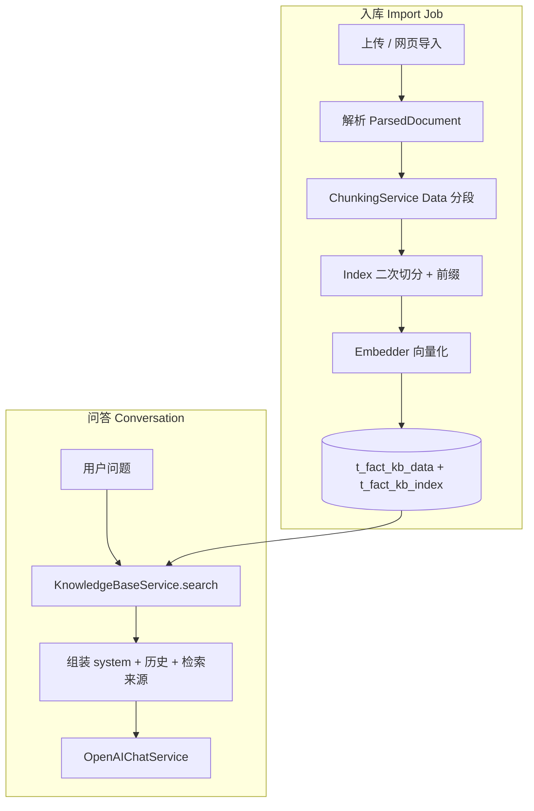

#  CAN-RAG 知识库与问答架构说明

本文档基于当前工程实现，说明知识库**分段（Chunking）**、**向量化模型选择**、**各文件类型解析与分段**、**相似性检索**、**问答（含流式）以及多轮对话**的端到端行为。代码路径均以仓库根目录为基准。

---

## 1. 总览




| 层级        | 表 / 存储                                          | 用途                                                            |
| --------- | ----------------------------------------------- | ------------------------------------------------------------- |
| **Data**  | `app.t_fact_kb_data`                            | 面向展示的原文块（`data_id` 如 `d000000`）；citation 的 `chunkId` 通常对应此 ID |
| **Index** | `app.t_fact_kb_index`                           | 面向检索的向量行（`index_id` 如 `d000000-000`）；一条 Data 可对应多条 Index      |
| **会话**    | `app.t_dim_conversation` + `app.t_fact_message` | 多轮消息；配置 `DATABASE_URL` 时由 PostgreSQL 持久化                      |


更细的表结构见 [backend-development-guide.md](confluence/backend-development-guide.md) 第 3～8 节。

### 1.1 向量存储：PostgreSQL 还是本地？

**取决于环境变量，并非默认一定在 PostgreSQL。**

| 条件 | 向量存哪 | 检索走哪 |
|------|----------|----------|
| `RAG_BACKEND=postgres_pgvector` **且** 配置了 `DATABASE_URL` | **PostgreSQL**：`app.t_fact_kb_data` + `app.t_fact_kb_index`（`vector(256)` + HNSW） | `search_data()`，按 `kb_id` 查 |
| `RAG_BACKEND=local`（**代码默认**） | 本地 JSON：`app/storage/vector_store/` 等 | 同样逻辑的 `search_data`，或旧版 `rag_chunks` |
| 仅有 `DATABASE_URL`、`RAG_BACKEND` 仍为 `local` | **会话消息**可进 PG；**知识库向量仍在本地 JSON** | 问答传 `kb_id` 时仍可能走 local 的 `search_data` |

**与多轮对话分开的两套 PostgreSQL 数据：**

- **知识库向量**：`t_fact_kb_*`（由 `RAG_BACKEND` 决定）
- **会话历史**：`t_dim_conversation` + `t_fact_message`（由 **`DATABASE_URL`** 决定，与向量 backend 无关）

**如何确认当前环境向量是否在 PG：**

```bash
# .env 中应同时配置，例如：
# DATABASE_URL=postgresql+psycopg://...
# RAG_BACKEND=postgres_pgvector
```

```sql
-- 某知识库下 index 向量行数量
SELECT kb_id, file_id, COUNT(*) AS index_rows
FROM app.t_fact_kb_index
GROUP BY kb_id, file_id
LIMIT 10;
```

若表为空但问答仍能命中，可能仍在使用 **local JSON** 或 legacy `rag_chunks` 路径。

---

## 2. 入库流水线

### 2.1 触发方式

1. **文件上传** → 创建 `import-job`（`[app/api/v1/import_job_routes.py](../app/api/v1/import_job_routes.py)`）
2. **网页导入** → 抓取为 Markdown 落盘后同样走 import-job（`[app/services/web_import_service.py](../app/services/web_import_service.py)`）
3. **后台执行**：`ImportJobWorker` + 可选 `ImportJobPoller`（`[app/core/bootstrap.py](../app/core/bootstrap.py)`）

单文件处理逻辑在 `[app/services/import_job_runner.py](../app/services/import_job_runner.py)` 的 `build_process_file()`：


| 阶段  | `ImportJobStage` | 说明                                                            |
| --- | ---------------- | ------------------------------------------------------------- |
| 解析  | `PARSE`          | 按扩展名选择解析器，产出 `ParsedDocument`                                 |
| 分段  | `CHUNK`          | `ChunkingService.split_and_index()`                           |
| 向量化 | `EMBED`          | 对 Index 文本批量 `embed_many`（batch=32）                           |
| 写入  | `INDEX`          | `RagPipeline.index_data()` → `upsert_data_index`；可选 VLM 图片描述块 |


### 2.2 Data 与 Index 两段式分段

核心类：`[app/services/rag/chunking_service.py](../app/services/rag/chunking_service.py)`

1. `**split()`**：把 `ParsedDocument` 切成若干 **DataChunk**（用户可见的「分段」粒度）。
2. `**build_indexes()`**：对每个 DataChunk 再按 `**indexSize**`（默认来自 `ChunkingConfig`，未指定时用 `RAG_CHUNK_SIZE`）做二次切分，得到 **IndexChunk**。
3. **Index 前缀**（可选）：若 `metaFilename` / `metaHeadings` 为真，在嵌入前为 Index 文本加上 `文件：{fileName}`、`标题：{heading}`，提升检索可解释性。

ID 规则（`[app/services/rag/pipeline.py](../app/services/rag/pipeline.py)` `index_data`）：

- Data：`d{chunk_index:06d}` → `d000000`
- Index：`d{data:06d}-{index_in_data:03d}` → `d000000-000`
- 独立图片（VLM）：`img{page:04d}-{idx:03d}` + index `...-000`

---

## 3. 分段策略（ChunkingOptions）

HTTP 请求体定义：`[app/api/schemas/import_job.py](../app/api/schemas/import_job.py)` → 持久化为 `[app/domain/import_job.py](../app/domain/import_job.py)` 的 `ChunkingConfig`。


| `strategy` | 行为                                                   | 状态            |
| ---------- | ---------------------------------------------------- | ------------- |
| `default`  | 全文递归切分；有 Markdown 标题时按 **section** 切分                | ✅ 默认          |
| `page`     | 按 `ParsedBlock.page` 分块，超长再递归切                       | ✅             |
| `custom`   | 需 `custom.mode`：`paragraph` / `length` / `separator` | ✅             |
| `whole`    | 整文件一块                                                | ❌ API 与运行时均拒绝 |


### 3.1 `default` 策略细节

- 若文档块带 **heading**（常见于 PDF 增强、DOCX、有标题的 MD）：按块生成 `## 标题\n\n正文`，块内过长再递归切。
- 否则：对 `glue_images_to_paragraphs(full_text)` 做 **RecursiveCharacterTextSplitter**，分隔符优先级：`\n\n` → `\n` → `。` → `.`  → 空格。
- 默认尺寸：`[app/core/config.py](../app/core/config.py)` 中 `RAG_CHUNK_SIZE`（800）、`RAG_CHUNK_OVERLAP`（120），可被 job 的 `length` / `default` 覆盖。

### 3.2 `custom` 子模式


| `custom.mode` | 说明                                                             |
| ------------- | -------------------------------------------------------------- |
| `paragraph`   | 按段落分隔符深度 `paragraph.maxDepth` 递归切（`useModel` 字段预留，**当前未调用模型**） |
| `length`      | 固定 `chunkSize` / `overlap` / `maxChunkSize`                    |
| `separator`   | 按自定义分隔符列表切，超长再用 `CharacterTextSplitter`                        |


### 3.3 `indexSize`

- 控制 **Index 层**最大字符数（嵌入输入长度），须满足 `indexSize ≤ length.maxChunkSize`（custom length 时校验）。
- Data 块可以很大，但检索在更短的 Index 向量上进行，检索后再 **按 data_id 聚合** 回 Data 文本。

---

## 4. 不同文件类型的解析与分段

解析入口：`[app/services/import_job_runner.py](../app/services/import_job_runner.py)`（import-job 路径）与 `[app/services/rag/parsing/__init__.py](../app/services/rag/parsing/__init__.py)` 的 `get_parser_for()`。


| 类型                | 解析方式                                                                                                                                      | 分段特点                                                                                                |
| ----------------- | ----------------------------------------------------------------------------------------------------------------------------------------- | --------------------------------------------------------------------------------------------------- |
| **PDF**           | `[parse_pdf_with_options()](../app/services/rag/parsing/pdf_to_markdown.py)`：可选文本提取 + **pdfEnhancement**（按页 VLM→Markdown，图存 `kb_images/`） | 增强后常有 `## Page n` 与 heading → 倾向 **按 section 的 default**；`pdfEnhancement=true` 时自动打开 `metaHeadings` |
| **DOCX**          | `[DocxDocumentParser](../app/services/rag/parsing/docx_parser.py)`：正文 + 内嵌图提取                                                             | 有 heading 时按 section；图示已写入正文 Markdown 时 **不再**对每张图单独 VLM                                            |
| **MD / Markdown** | `[MarkdownDocumentParser](../app/services/rag/parsing/md_parser.py)`                                                                      | 按标题块；图片路径可解析为 `kb_images`                                                                           |
| **TXT**           | `[TxtDocumentParser](../app/services/rag/parsing/txt_parser.py)`                                                                          | 纯文本 default 递归切                                                                                     |
| **PPTX**          | `[PptxDocumentParser](../app/services/rag/parsing/pptx_parser.py)`                                                                        | 经 `get_parser_for` 走通用解析                                                                            |
| **网页**            | 抓取 → 存为 `.md` → 同 Markdown 路径                                                                                                             | 同 MD                                                                                                |


### 4.1 图示与 VLM 额外分段

`[RagPipeline.index_data()](../app/services/rag/pipeline.py)` 在正文入库后，对 `ParsedDocument.images` 中尚未写入正文的图片：

- 调用 `[VlmService.describe_image()](../app/services/rag/vlm_service.py)` 生成描述文本；
- 写入独立 **Data + Index**（`type: image`，`storage_key` 指向 `kb_images/...`）。

是否强制对每张图跑 VLM 由 import 的 `parsing.imageVlmIndex` 与文件类型共同决定（DOCX / PDF 增强正文已含图时默认跳过重复 VLM）。

### 4.2 分段入库示例：Markdown / PDF / DOCX

三种类型共用同一条链：

```text
文件 → ParsedDocument（blocks + images + full_text）
     → ChunkingService.split()         → 多条 DataChunk（d000000, d000001, …）
     → ChunkingService.build_indexes() → 多条 IndexChunk（d000000-000, d000001-000, …）
     → embed(Index 文本)               → 向量
     → upsert → t_fact_kb_data + t_fact_kb_index（PG）或 JSON（local）
```

默认 import 一般为 `strategy: default`；Index 层常按 `RAG_CHUNK_SIZE`（800 字）再切，检索时在 Index 上算相似度，再 **按 data_id 聚合** 回 Data 全文。

#### 示例 A：Markdown（`.md`）

**解析**（`MarkdownDocumentParser`）

- 按 `#` 标题拆成多个 `ParsedBlock`（带 `heading`）
- 文内 `` 保留在正文中

**分段（default）**

- 因有 heading → **按 section**：每块形如 `## 安装步骤\n\n正文…`
- 单 section 超过 `maxChunkSize`（默认 800）再按 `\n\n`、句号等递归切
- 例：一篇 3 个大标题的 MD → 约 3～10 个 **Data**；每个 Data 再拆 1～N 个 **Index** 去向量

**写入向量库后（概念上一行 Index）**

- 嵌入文本可能为：`文件：手册.md\n标题：安装步骤\n\n（正文片段…）`
- 向量在 `t_fact_kb_index.embedding`；展示/ citation 用 `t_fact_kb_data.text`

#### 示例 B：PDF（`.pdf`）

由 import 的 `parsing.pdfEnhancement` 决定（默认常为 **true**）：

**路径 1：PDF 增强（`pdfEnhancement=true`，需 `OPENAI_API_KEY`）**

1. 按页 VLM/渲染 → 每页 Markdown，如 `## Page 3` + 正文 + ``
2. 自动 `metaHeadings=true`，按页/标题块分段（类似 MD）
3. 正文已含图时，一般 **不再** 对每页图单独建 `img0001-xxx` 段（避免与正文重复）

**路径 2：仅文本提取（`pdfEnhancement=false`）**

1. `PdfDocumentParser` 抽取文本（可选抽内嵌图）
2. 无明显 heading → **整篇 full_text 递归切** 为约 800 字一块的 Data
3. 若 `imageVlmIndex` 且图未进正文 → 每张图可能多一条 **VLM 描述** Data/Index（`type: image`）

**举例（增强模式，10 页政策 PDF）**

- Parse：约 10 个 block（每页一块）+ 若干 `kb_images`
- Chunk：每页 1 个 Data 或页内过长再拆 → 约 10～30 个 Data
- Index：每个 Data 再按 800 字切 → 多行写入 PG；检索时对同一 `data_id` 取 **MAX 相似度**

#### 示例 C：DOCX（`.docx`）

**解析**（`DocxDocumentParser`）

- 段落/标题 → `ParsedBlock`（可有 `heading`）
- 内嵌图导出到 `kb_images/`，正文中嵌 Markdown 图片链接

**分段**

- 有 heading → **按章节 section**（同 MD）
- DOCX 正文已含图时，import 逻辑 **避免** 再对每张图单独 VLM 分段（与 PDF 增强类似）

**举例（员工手册 docx，5 章）**

- 可能 5 个主 Data（每章一块），章内过长再拆
- 问答命中 `d000002` 时，citation 展示该 Data 全文（含图示路径）

### 4.3 三种类型对比（入库侧）

| 类型 | 解析结果特点 | default 分段倾向 | 图示 |
|------|----------------|------------------|------|
| **Markdown** | 标题块清晰 | 按 `## 标题` section | MD 内链 `kb_images` |
| **PDF 增强** | 按页 Markdown + 页图 | 按页/标题 section | 图在正文 MD 里 |
| **PDF 纯文本** | 长 plain text | 全文递归约 800 字/块 | 可能单独 VLM image 段 |
| **DOCX** | 标题 + 段落 + 内嵌图 MD | 有标题则按章，否则递归 | 多在正文，少重复 VLM |

---

## 5. 向量化模型如何选择

逻辑集中在 `[app/services/rag/kb_embedding.py](../app/services/rag/kb_embedding.py)` 的 `resolve_kb_embedding_config()`。

### 5.1 模型 ID 来源（优先级）

1. 知识库元数据 `backend_refs.embeddingModelId`（创建 KB 时可指定）
2. 否则环境变量 `**OPENAI_EMBEDDING_MODEL`**（默认 `text-embedding-3-large`，见 `[app/core/config.py](../app/core/config.py)`）

### 5.2 后端：`openai` 还是 `hash`

由 `**RAG_EMBEDDING_BACKEND**` 与密钥、维度共同决定：


| 条件                             | 实际后端                                         |
| ------------------------------ | -------------------------------------------- |
| `RAG_EMBEDDING_BACKEND=hash`   | 本地 **HashEmbeddingService**（无需有效 OpenAI Key） |
| 未配置 `OPENAI_API_KEY`           | 回退 **hash**                                  |
| `RAG_EMBEDDING_BACKEND=openai` | **OpenAIEmbeddingService**                   |
| `auto`（默认）                     | 有 Key 且维度合法 → **openai**；否则 **hash**         |


### 5.3 维度 `RAG_EMBEDDING_DIMENSIONS`

- 默认 **256**，须与库表 `app.t_fact_kb_index.embedding vector(256)` 一致（迁移 `[0004_kb_data_index.sql](../app/migrations/0004_kb_data_index.sql)`）。
- `text-embedding-3-`*：维度不得低于 OpenAI 最小要求，且不得超过模型目录上限（见 `[app/domain/model_catalog.py](../app/domain/model_catalog.py)`），否则 **回退 hash**。
- `text-embedding-ada-002`：仅支持 **1536** 维，与配置不一致时回退 hash。

### 5.4 嵌入实例缓存

`[EmbedderFactory](../app/services/rag/kb_embedding.py)` 按 `(model_id, dimensions, backend)` 缓存 embedder，同一 KB 检索与入库共用同一配置（`[KnowledgeBaseService.resolve_embedding_config()](../app/services/knowledge_base_service.py)`）。

---

## 6. 相似性检索如何实现

### 6.1 调用链（问答 / Hit-Test）

```
ConversationService._retrieve_citations()
  → KnowledgeBaseService.search(kb_id=...)
      → 优先 _multi_vector_search() → RagPipeline.search_data()  [postgres_pgvector + kb_id]
      → 否则 RagPipeline.search()                                  [legacy 单向量]
  → postprocess_search_hits()  # 去重、过滤低质量 image 段
```

相关代码：`[app/services/knowledge_base_service.py](../app/services/knowledge_base_service.py)`、`[app/services/rag/retrieval_postprocess.py](../app/services/rag/retrieval_postprocess.py)`。

### 6.2 `search_data`（生产推荐，Data/Index 模型）

当传入 `**kb_id**` 且 `RAG_BACKEND=postgres_pgvector` 时：

1. 用与入库相同的 **Embedder** 对 query 做 `embed(query)`。
2. 在 `**app.t_fact_kb_index`** 上做向量相似度（pgvector `**<=>**` 余弦距离），SQL 中对同一 `(file_id, data_id)` **取 MAX 分数** 聚合到 Data 级（`[PgVectorStore.search_data()](../app/services/rag/vector_store.py)`）。
3. 返回 **Data 级** `SearchHit`（`chunkId` = `data_id`，`snippet` = data 全文）。

本地 JSON 向量库（`RAG_BACKEND=local`）逻辑相同：遍历 index 行算 cosine，按 data 取 best score（`[JsonVectorStore.search_data()](../app/services/rag/vector_store.py)`）。

### 6.3 Legacy `search()`（旧文档级索引）

`[_HashRagPipeline.search()](../app/services/rag/pipeline.py)`：

- 使用 **legacy hash embedder**（与 KB 级 embedder 可能不一致）；
- 检索 `rag_chunks` / JSON 单向量表，先取 `top_k * 3` 再 **SimpleReranker** 重排。

无 `kb_id` 或 `search_data` 不可用时回退到此路径。

### 6.4 检索后处理

`[postprocess_search_hits()](../app/services/rag/retrieval_postprocess.py)`：

- 丢弃 VLM 拒绝类描述的 `type=image` 命中；
- 若已有正文 text 段，去掉重复的独立 image 段；
- 按 `storage_key` 去重，**优先保留 text 段**。

### 6.5 问答中的检索 query

`[ConversationService._build_retrieval_query()](../app/services/conversation_service.py)`：

- 拼接会话中最近 `**CHAT_HISTORY_MAX_TURNS`** 条用户消息 + 当前问题（换行连接）；
- 用于提升「刚才第二点」「继续说明」类追问的召回，与 LLM 多轮历史互补。

每 KB 默认取 top **5**（`RAG_TOP_K`），多 KB 时合并后按 score 排序截断。

---

## 7. 问答如何实现

### 7.1 API


| 能力     | 路径                                            | 服务方法               |
| ------ | --------------------------------------------- | ------------------ |
| 非流式    | `POST /v1/conversations/{id}/messages`        | `send_message()`   |
| 流式 SSE | `POST /v1/conversations/{id}/messages:stream` | `stream_message()` |


路由：`[app/api/conversation_routes.py](../app/api/conversation_routes.py)`  
核心：`[app/services/conversation_service.py](../app/services/conversation_service.py)`  
LLM：`[app/services/openai_chat_service.py](../app/services/openai_chat_service.py)`

### 7.2 单轮处理步骤

1. **校验**会话状态、消息长度、是否已有进行中的流式生成。
2. **绑定知识库**：请求体 `knowledgeBaseIds` 非空时写入会话（`bind_knowledge_bases`）；否则用会话已绑定列表。
3. **检索**：`_build_retrieval_query` → `_retrieve_citations` → `citations_from_hits` / `build_message_sources`。
4. **组装 Prompt**（`_build_chat_messages`）：
  - 若有 citations：插入 **system** 消息，内容为编号来源 `来源[n]` + snippet/markdown + 引用格式说明；
  - 追加会话 **历史** user/assistant（跳过 streaming 中且内容为空的 assistant）；
  - 非流式再 **append** 当前 user；流式则在之前已 `add_messages` 写入当前 user。
5. **多模态**（可选）：`[append_citation_figures_to_messages()](../app/services/chat_vision.py)` 在 `CHAT_VISION_ENABLED=true` 时，将 citation 图示以 `image_url` 注入最后一条 user 前。
6. **调用模型**：`complete` 或 `stream`；流式通过 SSE 事件：`message.created` → `retrieval.*` → `message.delta` → `usage.completed` → `message.completed` → `done`。
7. **后处理**：assistant 回答中 `kb_images/` 路径改写为可访问 URL（`[rewrite_markdown_asset_urls](../app/services/markdown_render.py)`）。

### 7.3 流式与持久化

- 流式开始：先 `add_messages`（user completed + assistant streaming）。
- 生成结束：`update_message` 写入 content、status、citations_json、sources_json、usage（**不在每个 delta 写库**）。
- 配置 `**DATABASE_URL`** 时使用 `[PostgresConversationRepository](../app/repositories/postgres_conversation_repository.py)`；否则内存仓储（进程重启丢失历史）。

---

## 8. 多轮对话如何实现

### 8.1 前提

前端续聊必须 **复用同一 `conversationId`**；每轮只提交当前 `content`，**不需要**在请求体携带历史数组。

### 8.2 历史如何进入 LLM

`[_build_chat_messages()](../app/services/conversation_service.py)` 遍历 `conversation.messages`（经 `_select_history_messages` 截断）：

- 包含已完成轮次的 **user / assistant** 文本；
- **跳过** `status=streaming` 的 assistant 与空 content；
- 当前轮 system 检索上下文 **仅含本轮** 新 citations，历史 assistant 中的 `[1]` 引用号可能与本轮来源编号不一致（已知限制）。

历史窗口：环境变量 `**CHAT_HISTORY_MAX_TURNS`**（默认 20，一轮 ≈ user+assistant 两条消息）；仅影响 LLM 输入，**不删除**库中旧消息。

### 8.3 发 LLM 前刷新

`[_load_conversation_for_generation()](../app/services/conversation_service.py)` 在组装 messages 前 `require(conversation_id)`，从 DB 重新加载消息列表，避免跨请求持有陈旧内存。

### 8.4 数据表

- `app.t_dim_conversation`：会话元数据、`last_message_at`
- `app.t_fact_message`：消息正文；`citations_json` / `sources_json`（迁移 `[0005_message_context_json.sql](../app/migrations/0005_message_context_json.sql)`）
- `app.t_fact_message_usage`：token 用量
- `app.t_fact_conversation_kb`：会话绑定的 KB 列表

### 8.5 自测脚本

[`scripts/test_multi_turn_integration.py`](../scripts/test_multi_turn_integration.py)：两轮对话 + 模拟重启后再问第三轮，校验历史仍在 LLM 上下文中。

### 8.6 多轮达到上限时会出现什么问题？

工程里与「上限」相关的主要配置是 **`CHAT_HISTORY_MAX_TURNS`（默认 20）**：约最近 20 条 **用户** 发言会参与拼接（检索 query 也按此截断）。**不会删除库里的旧消息**，只是 **不再全部送给 LLM**。

| 现象 | 原因 | 用户侧表现 |
|------|------|------------|
| **对话变「健忘」** | 超出窗口的 user/assistant 不进 `_build_chat_messages` | 「你刚才说的第三点」若发生在很早以前，模型记不住；`GET .../messages` 仍能看到全文 |
| **检索变「短视」** | `_build_retrieval_query` 同样只保留最近 N 条用户句 | 追问「继续上一节细节」时，若相关 **用户句** 在窗口外，向量检索可能偏掉 |
| **变慢 / 变贵 / 超长失败** | 历史 + 本轮 system（含 citation 全文）+ 可选 Vision 图占 context | 轮数多、KB 片段长时 token 暴涨；极端时 OpenAI **context 超限**（当前仅按轮数截断，未按 token 再裁） |
| **引用号 `[1][2]` 混乱** | 每轮检索插入 **新的** system 来源编号 | 历史回答里的 `[1]` 与本轮 system 的 `[1]` **不是同一段** |
| **并发流式冲突** | 同会话仅允许一路 `streaming` | 连续点发送可能收到 `MESSAGE_ALREADY_RUNNING` |
| **重启丢历史** | 未配置 `DATABASE_URL` 时用内存仓储 | 服务重启后同 `conversationId` 无消息，像「没有多轮」 |

**与知识库分段的关系：**

- KB 里的 Data/Index **不受**多轮窗口影响；分段结果一直在向量库中。
- 多轮只影响：**本轮检索 query 怎么拼**、**LLM 看到多少轮 chat history**。
- 产品长会话建议：控制单轮 citation 数量、必要时调低 `CHAT_HISTORY_MAX_TURNS` 或后续做按 token 裁剪（当前未实现）。

---

## 9. 配置速查


| 变量                         | 默认                       | 作用                                                   |
| -------------------------- | ------------------------ | ---------------------------------------------------- |
| `DATABASE_URL`             | 空                        | 配置后：会话 PostgreSQL、KB Data/Index 表、import-job         |
| `RAG_BACKEND`              | `local`                  | `postgres_pgvector` / `langchain_pgvector` / `local` |
| `RAG_CHUNK_SIZE`           | 800                      | default 策略 Data 块目标大小                                |
| `RAG_CHUNK_OVERLAP`        | 120                      | default / length 重叠                                  |
| `RAG_EMBEDDING_DIMENSIONS` | 256                      | 向量维度，须与 PG 列一致                                       |
| `RAG_EMBEDDING_BACKEND`    | `auto`                   | `auto` / `openai` / `hash`                           |
| `OPENAI_EMBEDDING_MODEL`   | `text-embedding-3-large` | 默认嵌入模型                                               |
| `OPENAI_CHAT_MODEL`        | `gpt-4.1-mini`           | 默认对话模型（可被请求 `modelId` 覆盖）                            |
| `CHAT_HISTORY_MAX_TURNS`   | 20                       | 多轮 LLM / 检索 query 窗口                                 |
| `CHAT_VISION_ENABLED`      | true                     | 检索图示是否注入 Chat Vision                                 |
| `VLM_ENABLED`              | false                    | 入库图片描述是否调用 VLM                                       |


---

## 10. 相关文档与测试


| 文档 / 测试                                                                 | 说明                             |
| ----------------------------------------------------------------------- | ------------------------------ |
| [backend-development-guide.md](confluence/backend-development-guide.md) | 表结构、ChunkingOptions 字段表、SSE 事件 |
| [frontend-api-integration.md](confluence/frontend-api-integration.md)   | 前端联调、import-job 示例、多轮说明        |
| `tests/test_postgres_conversation_repository.py`                        | 会话 PG 仓储                       |
| `tests/test_conversation_multi_turn.py`                                 | 多轮 LLM 上下文                     |
| `tests/test_chunking_service.py`                                        | 分段策略单元测试                       |
| `tests/test_kb_data_index_repository.py`                                | Data/Index 表                   |


---

*文档版本与代码同步至 main 分支多轮 PostgreSQL 持久化实现；若行为变更请优先以代码为准更新本节。*